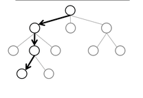
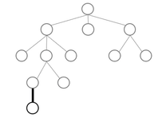
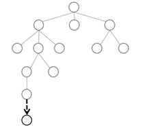
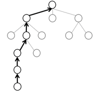
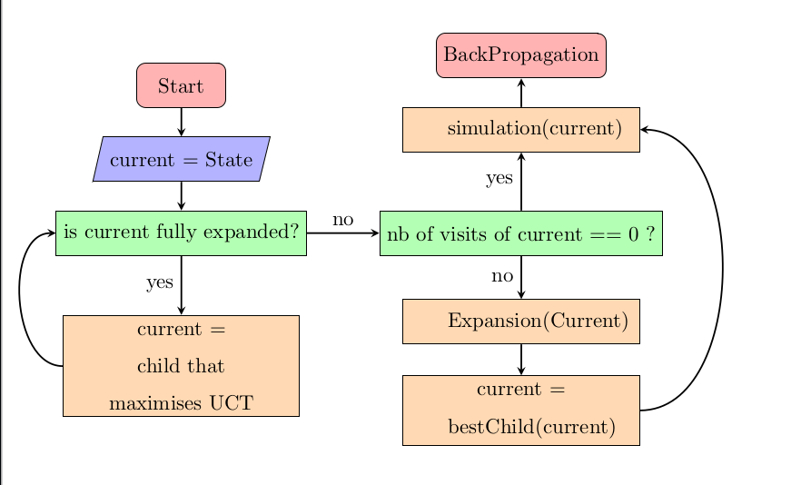

## Explanation

**MCTS: Monte Carlo Tree Search** is a decision-making algorithm used to explore possible choices/moves in a game or complex problem. It is particularly useful for games like Hex, where there is a large number of possible moves and it is difficult to predict which move is the best.

The main idea of **MCTS** is to simulate many random games from the current game state, then use the results of these simulations to decide which move is the most promising.

## How it Works

The algorithm's search tree is represented by **Nodes**, where each node contains a set of information (the move involved, the grid representing the game state after this action, the parent node, the number of wins, the number of losses, and the number of visits).

* We refer to a **terminal node/final state** as a node where there are no more possible moves from its state (all cells are filled) or a winner exists (game over).
* We refer to a **complete node** as a node where every possible action from its state exists in one of its children; in other words, a node that has the same number of children as there are possible moves from its state.

The MCTS algorithm works by repeating 4 major steps iteratively and returns the move with the highest Win/Loss score at the end of the iterations.

### Step 1: Selection

**Objective**: Traverse the search tree to find an "interesting" node to explore, where each node represents a move and the resulting grid from that move.

**How**:
- The algorithm traverses the tree starting at the root (the current state of the game) and chooses the child (possible move) that maximizes the value obtained using a formula called **UCT** (*Upper Confidence Bound for Trees*) each time until reaching **a node that has not been fully explored and is not a final state**. This approach ensures that partially developed nodes have a chance to produce new children.

**UCT Formula**:
$$w/n + C * \sqrt{\ln(N)/n}$$

Where:
- **w**: number of simulated winning games from this node.
- **n**: number of times the node has been visited.
- **N**: number of times the parent node has been visited.
- **C**: exploration parameter—theoretically equal to $\sqrt{2}$, in practice chosen experimentally.

**Balance between Exploration and Exploitation**:
- **Exploitation**: Choosing moves that have already yielded good results.
- **Exploration**: Trying moves that have not yet been explored much.

### Step 2: Expansion

**Objective**: Add a new node to the tree to explore a move not yet tried.

**How**:
- If **the node selected in the selection phase has already been visited, is not a terminal state, and is not a complete node**, it is developed by adding a possible action chosen at random from the set of possible moves from its state. This addition is represented by adding a new node containing the played move and the resulting state to the tree.
- Otherwise, if the selected node has never been visited, we proceed directly to the simulation phase.

### Step 3: Simulation

**Objective**: Simulate a random game from the best child (including the newly added node) to estimate its value.

**How**:
- A random game is played starting from the game state represented by the new node by choosing a random move for each player every turn until a final state is reached.
- The simulation ends when the game is over (victory, defeat, or draw) where the grid is entirely filled.
- The simulation result is recorded (1 for a win, -1 for a loss).

### Step 4: Backpropagation

**Objective**: Update the statistics of the nodes visited during selection with the simulation result.

**How**:
- The algorithm moves back up the tree from the simulated node to the root.
- For each visited node, we update:
  - The number of visits.
  - The number of wins.
  - The number of losses.

## Algorithm

The following illustration shows the operation of the 4 steps of the MCTS algorithm for a given state.

## MCTS in Hex and Complexity

**MCTS is particularly effective for the game of Hex because**:
- For each state, there is a very large number of possible moves, and this algorithm explores intelligently by focusing on promising moves.
- There is no need for heuristic evaluation to estimate a move's value, unlike other algorithms, because MCTS relies on random simulations to estimate this value.

In our implementation:
- Each player has their own search tree to separate responsibilities and have more precise estimations according to the player.
- For efficiency reasons, only the subtree rooted at the selected node is kept at the end of each iteration.

---

## RAVE Optimization

### Explanation
**RAVE** (*Rapid Action Value Estimation*) is an extension of MCTS that aims to speed up the convergence of estimates by exploiting additional information from simulations.

RAVE estimates that:
- The value of an action is similar in all substates of the selected node's subtree regardless of the context.
- Every move played in a simulation is treated as if it were the first time that move had been played. Its contribution to the simulation result is recorded, and this result is used as a generalization of the value of that move throughout the subtree starting at the current node's parent.

Unlike classic MCTS, which updates values only for nodes selected during the selection phase, **RAVE** records all actions played during the simulation phase. At the end of the simulation, the result (victory or defeat) is assigned to all moves played during that simulation, not just the first move.

This principle allows the algorithm to collect statistics on moves even if they were played in different contexts or at different depths. It also provides an approximate value for each move in the search tree after only a few iterations.

To do this, each node stores two sets of statistics:
- **Classic Statistics**: Number of visits and number of wins, as in standard MCTS.
- **RAVE Statistics**: Number of times the action was played in a simulation (*RAVE visits*) and the number of times it led to a victory (*RAVE wins*).

The **RAVE Value** of an action is calculated as follows:
$$RAVE Value = RAVE Wins / RAVE Visits$$

The **MCTS Value** of an action is calculated as follows:
$$MCTS Value = wins / losses$$

### Implementation
In our project, we implemented **RAVE** by extending the MCTS tree node structure to include RAVE statistics.

The difference between MCTS and RAVE lies in three points:
1. **Selection**:
   - Instead of choosing the child that maximizes **UCT**, we choose the child that maximizes the combined value obtained by the formula:
     $$Combined Value = (1 - \beta) * MCTS Value + \beta * RAVE Value$$
   - Where **$\beta$** is a parameter that controls the relative importance of RAVE compared to MCTS. To give more weight to MCTS as the tree develops, we decrease **$\beta$** based on the node's RAVE visits:
     $$\beta = k / (k + Rave Visits)$$
     - **k** is a constant.

2. **Simulation**:
   - During the simulation phase, all actions played by the original player are recorded for update with the simulation result in the next phase.

3. **Backpropagation**:
   - During the backpropagation phase, the algorithm traverses the entire subtree looking for nodes containing the recorded actions and updates the **RAVE wins** and **RAVE visits** values of those concerned nodes.

---

### Pros/Cons

#### Advantages of RAVE:
- **Complexity**: RAVE allows finding a better move in fewer iterations compared to MCTS, although it is slower per iteration.
- **Better Exploration**: By using RAVE statistics, the algorithm can explore promising actions earlier.
- **Efficiency in high-branching games**: RAVE is particularly useful in games where the number of possible moves is high, like Hex.

#### Disadvantages of RAVE:
- **Slower per iteration**: Since RAVE must maintain two different statistics and updating them requires a tree traversal at the end of each simulation, it adds time complexity.
- **Lack of precision**: RAVE relies on move value estimation and generalization regardless of context, which can lead to incorrect estimations.

#### Advantages of MCTS:
- **Precision**: MCTS relies on direct simulation to estimate a move's value, leading to much more precise values.
- **Lower complexity per iteration**: MCTS is faster per iteration than RAVE, though it requires more iterations to converge.

#### Disadvantages of MCTS:
- **Iteration budget dependence**: The number of iterations performed per turn has a great influence on the ability of MCTS to find good moves.

### RAVE Use Cases
RAVE is particularly effective when:
- **High-branching games**: When the number of possible moves is high.
- **Short simulations**: When simulations are short and partial results provide valuable info.
- **Fast convergence needed**: When results must be found in a limited number of iterations.

**Note**: RAVE is especially effective in the early rounds (where possible moves are vast) but becomes less effective as the game progresses. We use a selection based on the combined RAVE and MCTS value to handle this.

### MCTS Use Cases
MCTS is particularly effective when:
- **Number of possible moves is low**: Allowing more simulations on nodes to converge toward a more precise value, especially in the late game of Hex.