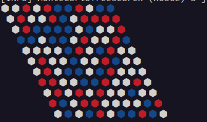
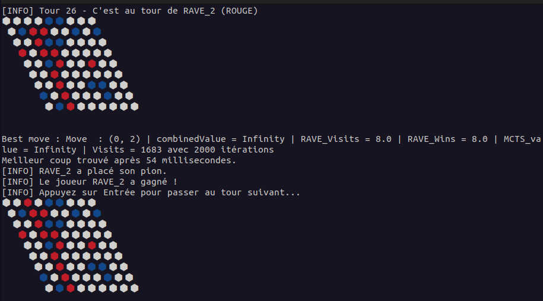
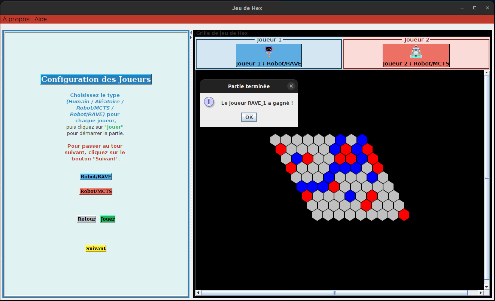

### INTRODUCTION :
Ce projet est l'implémentation du jeu HexGame en Java avec l'algorithme MCTS (Monte Carlo tree search) pour le joueur ia ainsi que l'optimisation RAVE pour le joueur ia MCTS







### DESCRIPTION DU PROJET:
le projet mets en place plusieurs fonctionnalitées :
- Execution du jeu en mode humain vs machine ou machine vs machine
- Visualisation du jeu en terminal et en mode graphique
- Implémentation de l'algorithme MCTS avec optimisation RAVE
- Tests unitaires 
- Expérimentations parametrables et modulaires
- Analyse des résultats de l'expérimentation

### DOCUMENTATION :

Vous pouvez trouver la documentation du projet en suivant [Ce lien](https://vycash.github.io/HexGame-MCTS-RAVE/files/javadoc/index.html) ou coller le lien ci-dessous dans votre navigateur:
```
https://vycash.github.io/HexGame-MCTS-RAVE/files/javadoc/index.html
```

### CONFIGURATION :

- Vous pouvez modifier la classe Constants.java dans le package src/config/ pour modifier les constantes globales du projet.
- Vous pouvez modifier les configurations des expérimentations dans le fichier experiment_config.json.
- Les autres paramètres du jeu sont configurables lors du lancement du jeu avec le script run.sh.


### EXECUTION :

Pour executer le projet sur votre machine vous devez d'bord cloner le projet dans un répertoire de votre choix en utilisant la commande :
```bash

git clone https://github.com/vycash/HexGame-MCTS-RAVE.git

```

#### Placez vous ensuite dans le repertoire cloné sur votre machine, il est nommé "HexGame-MCTS-RAVE/"

Ensuite, si vous êtes sur une machine de type Windows, cliquez directement sur le fichier  :
```
HexGame.bat
```

Si vous êtes sur une machine de type Linux, vous avez plusieurs options pour executez le progamme:
- executer la commande suivante pour jouer en mode graphique :
```bash

java -jar HexGame.jar GRAPHIQUE

```

- executer la commande suivante pour jouer en mode graphique :
```bash

java -jar HexGame.jar CONSOLE

```

- ou naviguer dans **files/** et executer le script **run.sh** pour le menu principal du jeu et choisir l'option que vous souhaitez (lancer le jeu, tests, expérimentations).
```bash
    cd files/
    ./run.sh
```

**Attention**: les expérimentations peuvent prendre plusieurs jours pour compléter toutes les combinaisons de configuration possible, il est fortement conseillé de lancer plusieurs configurations en parallèle pour économiser le temps.  

### ANALYSE D'EXPERIMENTATION:
pour executez l'analyse et le tracage des graphes des résultats des éxpérimentations il est nécessaire d'avoir installé python et les packages suivant :
 - matplotlib, pour l'installer executez la commande suivante : pip install matplotlib
 - pandas , pour l'installer executez la commande suivante : pip install pandas
 - seaborn , pour l'installer executez la commande suivante : pip install seaborn

Choisissez ensuite la fonctionnalité générer les graphes Python du menu principal du script **run.sh**

## l'arborescence du projet :
files/
├── experimentation/  
├── javadoc/  
├── lib/  
├── rapport/  
├── ressources/  
├── src/  
│   ├── config/  
│   ├── controller/  
│   ├── model/  
│   │   ├── mcts/  
│   │   └── player/  
│   ├── utils/  
│   │   └── strategyMessage/  
│   └── vue/  
└── testUnitaire/  
    ├── controller/  
    ├── model/  
    │   ├── mcts/  
    │   └── player/  
    ├── simulation/  
    ├── utils/  
    └── vue/  
ressources/
HexGame.bat
HexGame.jar
README.md
