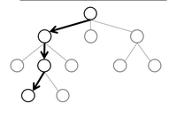
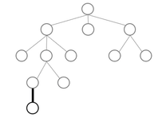
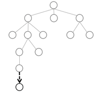
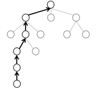
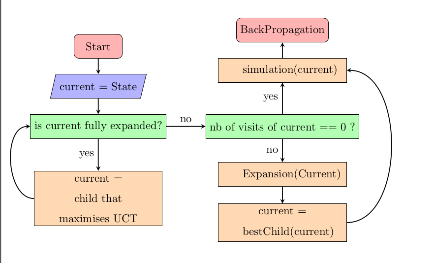

### INTRODUCTION :
Ce projet est l'implémentation du jeu HexGame en Java avec l'algorithme MCTS (Monte Carlo tree search) pour le joueur ia ainsi que l'optimisation RAVE pour le joueur ia MCTS

### DESCRIPTION DU PROJET:
le projet mets en place plusieurs fonctionnalitées :
- Execution du jeu en mode humain vs machine ou machine vs machine
- Visualisation du jeu en terminal et en mode graphique
- Implémentation de l'algorithme MCTS avec optimisation RAVE
- Tests unitaires 
- Expérimentations parametrables et modulaires
- Analyse des résultats de l'expérimentation

### DOCUMENTATION :

Vous pouvez trouver la documentation du projet en suivant [Ce lien](https://vycash.github.io/HexGame-MCTS-RAVE/files/javadoc/index.html) ou coller le lien ci-dessous dans votre navigateur:
```
https://vycash.github.io/HexGame-MCTS-RAVE/files/javadoc/index.html
```

### CONFIGURATION :

- Vous pouvez modifier la classe Constants.java dans le package src/config/ pour modifier les constantes globales du projet.
- Vous pouvez modifier les configurations des expérimentations dans le fichier experiment_config.json.
- Les autres paramètres du jeu sont configurables lors du lancement du jeu avec le script run.sh.


### EXECUTION :

Pour executer le projet sur votre machine vous devez d'bord cloner le projet dans un répertoire de votre choix en utilisant la commande :
```bash

git clone https://github.com/vycash/HexGame-MCTS-RAVE.git

```

#### Placez vous ensuite dans le repertoire cloné sur votre machine, il est nommé "HexGame-MCTS-RAVE/"

Ensuite, si vous êtes sur une machine de type Windows, cliquez directement sur le fichier  :
```
HexGame.bat
```

Si vous êtes sur une machine de type Linux, vous avez plusieurs options pour executez le progamme:
- executer la commande suivante pour jouer en mode graphique :
```bash

java -jar HexGame.jar GRAPHIQUE

```

- executer la commande suivante pour jouer en mode graphique :
```bash

java -jar HexGame.jar CONSOLE

```

- ou executer le script **files/run.sh** pour le menu principal du jeu et choisir l'option que vous souhaitez (lancer le jeu, tests, expérimentations).
```bash

./files/run.sh

```

**Attention**: les expérimentations peuvent prendre plusieurs jours pour compléter toutes les combinaisons de configuration possible, il est fortement conseillé de lancer plusieurs configurations en parallèle pour économiser le temps.  

### ANALYSE D'EXPERIMENTATION:
pour executez l'analyse et le tracage des graphes des résultats des éxpérimentations il est nécessaire d'avoir installé python et les packages suivant :
 - matplotlib, pour l'installer executez la commande suivante : pip install matplotlib
 - pandas , pour l'installer executez la commande suivante : pip install pandas
 - seaborn , pour l'installer executez la commande suivante : pip install seaborn

Choisissez ensuite la fonctionnalité générer les graphes Python du menu principal du script **run.sh**

## l'arborescence du projet :
files/
├── experimentation/  
├── javadoc/  
├── lib/  
├── rapport/  
├── ressources/  
├── src/  
│   ├── config/  
│   ├── controller/  
│   ├── model/  
│   │   ├── mcts/  
│   │   └── player/  
│   ├── utils/  
│   │   └── strategyMessage/  
│   └── vue/  
└── testUnitaire/  
    ├── controller/  
    ├── model/  
    │   ├── mcts/  
    │   └── player/  
    ├── simulation/  
    ├── utils/  
    └── vue/  
ressources/
HexGame.bat
HexGame.jar
README.md

# MCTS


## Explication

**MCTS : Monte Carlo Tree Search** est un algorithme de prise de décision utilisé pour explorer les choix/coups possibles dans un jeu ou un problème complexe.  
Il est particulièrement utile pour les jeux comme Hex, où il y a un grand nombre de coups possibles et où il est difficile de prédire quel coup est le meilleur.  

L'idée principale de **MCTS** est de simuler de nombreuses parties aléatoires à partir de l'état actuel du jeu, puis d'utiliser les résultats de ces simulations pour décider quel coup est le plus prometteur.  


## Fonctionnement

L'arbre de Recherche de l'algorithme est représenté par des Nœuds, où chaque nœud contient un ensemble d'informations (Le coup concerné, la grille représentant l'état du jeu après cette action, le nœud parent, le nombre de victoires, le nombre de pertes, et le nombre de visites).  

On désigne par un **nœud terminal/état final**, un nœud où il n'y a plus de coups possibles depuis son état (toutes les cases sont remplies) ou il existe un vainqueur (jeu terminé).  

On désigne par un **nœud complet**, un nœud où toute action possible depuis son état existe dans l'un de ses enfants, autrement dit : un nœud qui a le même nombre d’enfants que de coups possibles depuis son état.  

L'algorithme MCTS fonctionne en répétant 4 étapes majeures de manière itérative et renvoie à la fin des itérations le coup qui a le plus grand score Victoires/Défaites.  


### Étape 1 : Sélection

**Objectif** :  
Parcourir l'arbre de recherche pour trouver un nœud "intéressant" à explorer où chaque nœud représente un coup et la grille résultante de ce coup.  

**Comment** :
- L'algorithme parcourt l'arbre en commençant à la racine de l'arbre (l'état actuel du jeu) et choisit l'enfant (coup possible) qui maximise la valeur obtenue en utilisant une formule appelée UCT (*Upper Confidence Bound for Trees*) à chaque fois jusqu'à atteindre **un nœud qui n'a pas été totalement exploré et qui n'est pas un état final**.  
  Cette approche garantit que les nœuds partiellement développés ont une chance de produire de nouveaux enfants.  

**Formule UCT** :
$$
w/n + C * sqrt{ln(N)/n}
$$

où:
- **w** : nombre de parties gagnées simulées depuis ce nœud  
- **n** : nombre de fois où le nœud a été visité  
- **N** : nombre de fois où le nœud père a été visité  
- **C** : paramètre d'exploration — en théorie égal à sqrt{2}, en pratique choisi expérimentalement.  

**Équilibre entre exploration et exploitation** :
- **Exploitation** : Choisir des coups qui ont déjà donné de bons résultats.  
- **Exploration** : Essayer des coups qui n'ont pas encore été beaucoup explorés.




### Étape 2 : Expansion

**Objectif** :  
Ajouter un nouveau nœud à l'arbre pour explorer un coup non encore essayé.  

**Comment** :
- Si **le nœud sélectionné dans la phase de sélection a déjà été visité et qu'il n'est pas un état terminal et qu'il n'est pas un nœud complet**, on le développe en lui ajoutant une action possible choisie au hasard depuis l'ensemble des coups possibles à partir de son état.  
  Cet ajout est représenté par un ajout d'un nouveau nœud contenant le coup joué et l'état résultant à l'arbre.  
- Sinon, si le nœud sélectionné n'a jamais été visité, on passe directement à la phase de simulation.  



### Étape 3 : Simulation

**Objectif** :  
Simuler une partie aléatoire à partir du meilleur enfant (inclut le nouveau nœud ajouté) pour estimer sa valeur.  

**Comment** :
- On joue une partie aléatoire à partir de l'état du jeu représenté par le nouveau nœud en choisissant un coup aléatoire pour chacun des joueurs à chaque tour jusqu'à atteindre un état final.  
- La simulation se termine lorsque la partie est finie (victoire, défaite ou match nul) où la grille est entièrement remplie.  
- On enregistre le résultat de la simulation (1 pour une victoire, -1 pour une défaite).  



### Étape 4 : Rétropropagation

**Objectif** :  
Mettre à jour les statistiques des nœuds visités pendant la sélection avec le résultat de la simulation.  

**Comment** :
- L'algorithme remonte l'arbre depuis le nœud simulé jusqu'à la racine.  
- Pour chaque nœud visité, on met à jour :  
  - Le nombre de visites.  
  - Le nombre de victoires.  
  - Le nombre de défaites.  



## Algorithme

L'illustration suivante montre le fonctionnement des 4 étapes de l'algorithme MCTS pour un état donné.  



## MCTS dans le jeu de Hex et Complexité

**MCTS est particulièrement efficace pour le jeu de Hex, car :**
- Pour chaque état, il y a un très grand nombre de coups possibles, et cet algorithme explore de manière intelligente en se concentrant sur les coups prometteurs.  
- Il n'y a pas besoin d'évaluation heuristique pour estimer la valeur d'un coup contrairement à d'autres algorithmes, car MCTS repose sur des simulations aléatoires pour estimer cette valeur.  

Dans notre implémentation :
- Chaque joueur a un arbre de recherche propre à lui pour séparer les responsabilités et avoir des estimations plus précises selon le joueur.  
- Pour des raisons d'efficacité, seul le sous-arbre enraciné au nœud sélectionné est conservé à la fin de chaque itération.  

---

## RAVE Optimisation

### Explication
RAVE (*Rapid Action Value Estimation*) est une extension de MCTS qui vise à accélérer la convergence des estimations en exploitant des informations supplémentaires provenant des simulations.  

RAVE estime que :
- La valeur d'une action est similaire dans tous les sous-états du sous-arbre du nœud sélectionné n'importe le contexte.
- Chaque coup joué dans une simulation est traité comme si c'était la première fois que ce coup avait été joué. Sa contribution au résultat de la simulation est enregistrée, et ce résultat est utilisé comme généralisation de la valeur de ce coup dans l'ensemble du sous-arbre commençant au parent du nœud actuel.

Contrairement à MCTS classique, qui utilise le résultat de la simulation pour mettre à jour les valeurs uniquement des nœuds sélectionnés lors de la phase de sélection (les nœuds constituant le chemin du nœud sélectionné remontant jusqu'à la racine), **RAVE** enregistre toutes les actions jouées pendant la phase de simulation. À la fin de la simulation, le résultat (victoire ou défaite) est attribué à tous les coups qui ont été joués pendant cette simulation, et pas seulement au premier coup.

Ce principe permet à l'algorithme de recueillir des statistiques sur les coups, même s'ils ont été joués dans des contextes différents ou à des profondeurs différentes. Il fournit également une valeur approximative de chaque coup dans l'arbre de recherche après seulement quelques itérations.

Pour effectuer cela, chaque nœud stocke deux ensembles de statistiques :
- **Statistiques classiques** : Nombre de visites et nombre de victoires, comme dans le MCTS standard.
- **Statistiques RAVE** : Nombre de fois où l'action a été jouée dans une simulation (*RAVE visits*) et nombre de fois où elle a conduit à une victoire (*RAVE wins*).

La valeur RAVE d'une action **RAVE Value** est calculée comme suit  :
$$
RAVE Value = RAVE Wins/RAVE Visits
$$

La valeur MCTS d'une action **MCTS Value** est calculée comme suit  :
$$
MCTS Value = victoires/défaites
$$

### Implémentation
Dans notre projet, nous avons implémenté **RAVE** en étendant la structure de nœuds de l'arbre MCTS pour inclure les statistiques RAVE.

La différence entre le MCTS et le RAVE repose sur trois points :
1. **Sélection** :
   - Au lieu de choisir l'enfant qui maximise **UCT**, on choisit l'enfant qui maximise la valeur combinée obtenue par la formule :
     $$
     Combined Value = (1 - **beta**) * MCTS Value + **beta** * RAVE Value
     $$
   - Où **beta** est un paramètre qui contrôle l'importance relative de RAVE par rapport à MCTS.
   - Pour donner plus de poids à MCTS à mesure que l'arbre se développe, nous faisons décroître **beta** en fonction du nombre de visites RAVE du nœud :
     $$
     **beta** = k/k+Rave Visits
     $$
     - **k** est une constante.
     - **n** est le nombre de visites RAVE du nœud.

2. **Simulation** :
   - Pendant la phase de simulation, toutes les actions jouées par le joueur original sont enregistrées pour mise à jour avec le résultat de la simulation dans la phase suivante.

3. **BackPropagation** :
   - Pendant la phase de rétropropagation, l'algorithme parcourt tout le sous-arbre en recherche de nœuds contenant les actions enregistrées, et met à jour les valeurs **RAVE wins** et **RAVE visits** de ces nœuds concernés.

---

### Avantages/Inconvénients

#### Avantages de RAVE :
- **Complexité** : RAVE permet de trouver un meilleur coup en moins d'itérations par rapport à MCTS, bien qu'il soit plus lent par itération.
- **Meilleure exploration** : En utilisant les statistiques RAVE, l'algorithme peut explorer des actions prometteuses plus tôt.
- **Efficacité dans les jeux à grand nombre de branches** : RAVE est particulièrement utile dans les jeux où le nombre de coups possibles est élevé, comme le jeu de Hex.

#### Inconvénients de RAVE :
- **Plus lent par itération** : Puisque RAVE doit maintenir deux statistiques différentes, et la mise à jour des statistiques RAVE nécessite un parcours de l'arbre à chaque fin de simulation, cela ajoute une complexité dans le temps d'exécution.
- **Manque de précision** : RAVE repose sur l'estimation et la généralisation des valeurs des coups, indépendamment du contexte. Cela peut conduire à des estimations incorrectes, car un coup efficace dans un contexte spécifique peut ne pas l'être dans un autre.

#### Avantages de MCTS :
- **Précision** : MCTS repose sur la simulation directe d'un coup pour estimer sa valeur, ce qui mène à des valeurs beaucoup plus précises.
- **Moins de complexité par itération** : MCTS est plus rapide par itération que RAVE, bien qu'il nécessite un plus grand nombre d'itérations pour converger.

#### Inconvénients de MCTS :
- **Dépendance au budget d'itérations** : Le budget d'itérations (nombre d'itérations effectuées par tour) a une grande influence sur l'efficacité et la capacité de MCTS à trouver de bons coups.


### Cas d'utilisation de RAVE
RAVE est particulièrement efficace dans les situations suivantes :
- **Jeux à grand nombre de branches** : Lorsque le nombre de coups possibles est élevé, RAVE permet d'explorer plus rapidement les actions prometteuses.
- **Simulations courtes** : RAVE est utile lorsque les simulations sont courtes et que les résultats partiels peuvent fournir des informations précieuses.
- **Convergence rapide nécessaire** : Lorsque des résultats doivent être trouvés dans un nombre limité d'itérations.

**Note** : RAVE est particulièrement efficace dans les premiers tours du jeu (où l'ensemble des coups possibles est très large), permettant de trouver de bons coups rapidement. Cependant, il devient graduellement moins efficace au fil du jeu, lorsque des coups plus forts et plus précis sont requis. Pour contourner cela, nous utilisons une sélection basée sur la valeur combinée de RAVE et MCTS.

### Cas d'utilisation de MCTS
MCTS est particulièrement efficace lorsque :

- **Nombre de coups possibles est bas** : MCTS permet d'effectuer plus de simulations sur les nœuds et de converger vers une valeur plus précise et un résultat plus fiable, notamment dans les derniers tours du jeu de Hex.

